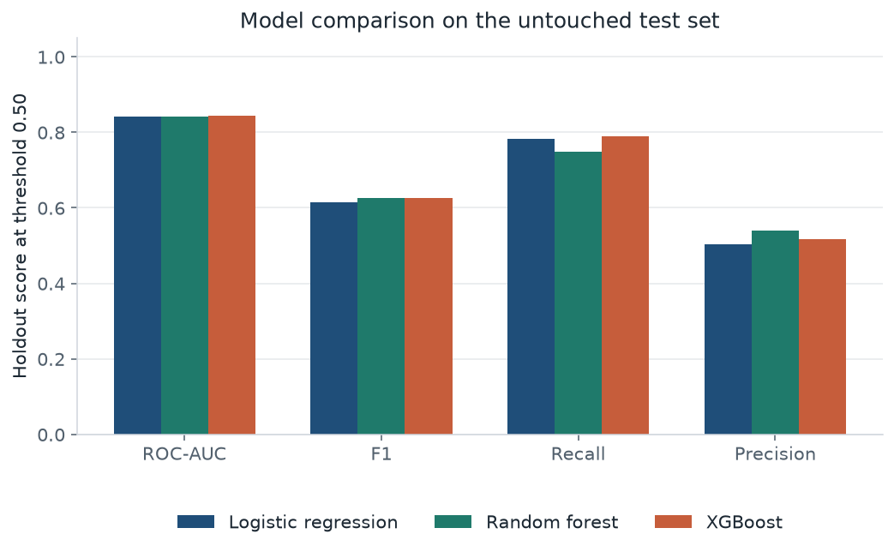
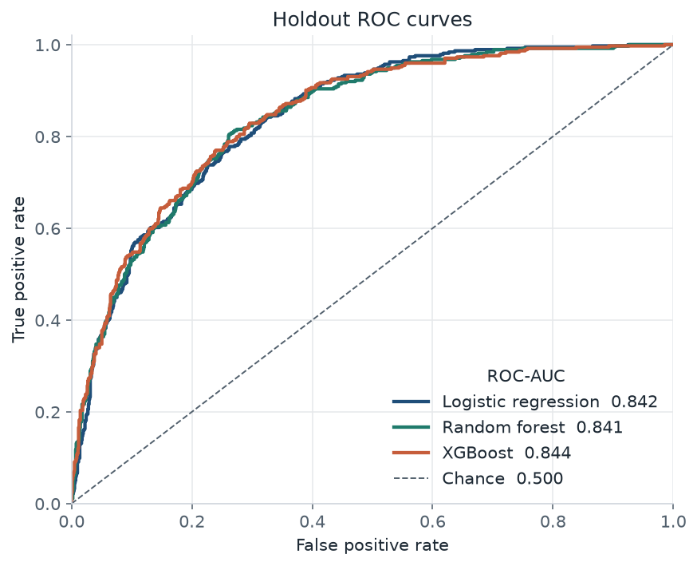
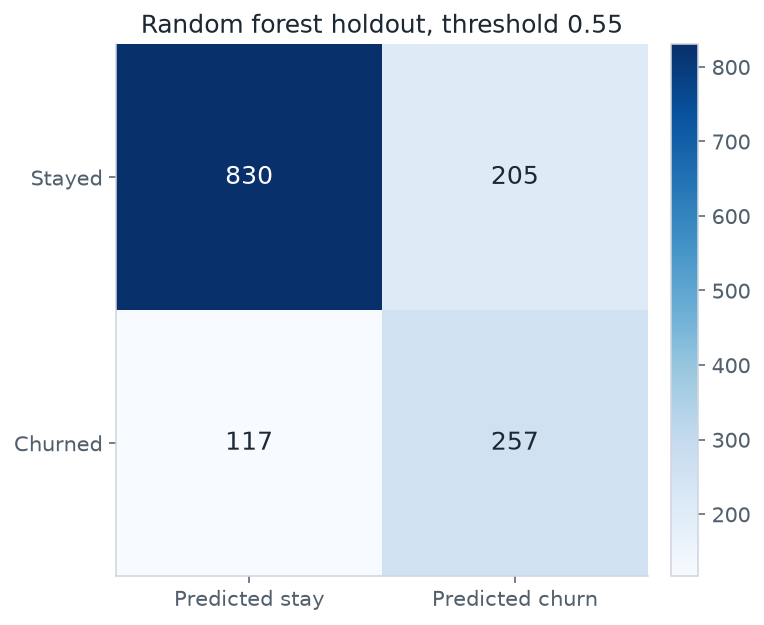
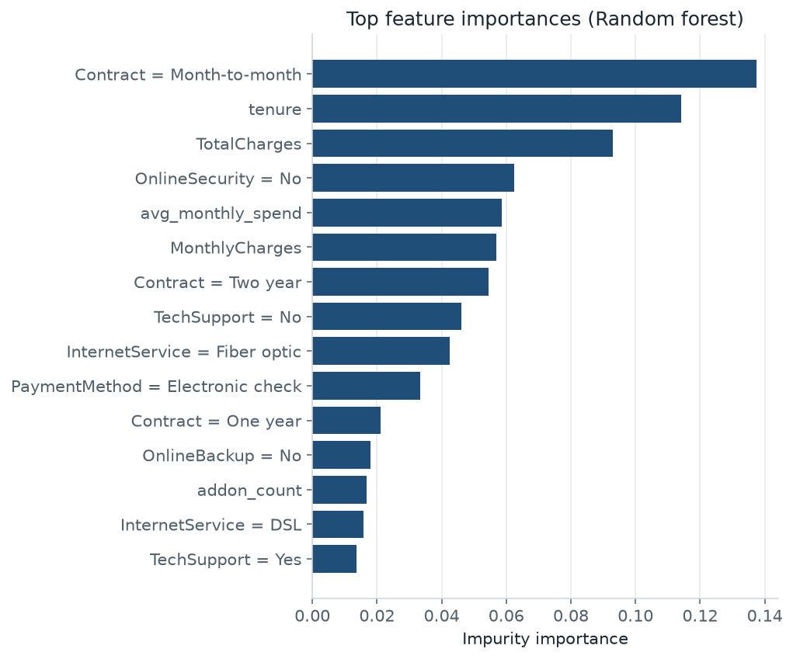
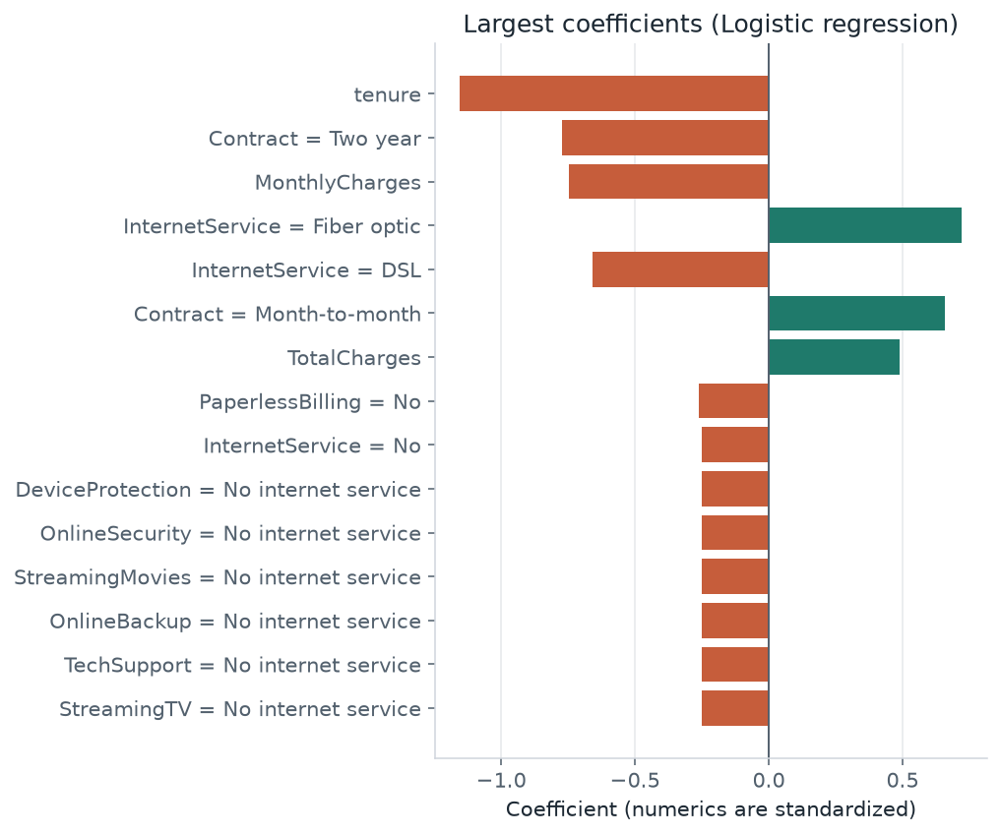

# Customer churn prediction

Portfolio project for data and machine learning roles, written from an electromechanical engineering background: measure the accounts, keep the split honest, and connect the score to a decision.

The task is to flag telecom customers who are likely to leave, using the public IBM Telco Customer Churn sample (7,043 customers, 26.5% churn). Logistic regression, a random forest, and XGBoost share one scikit-learn pipeline. The saved model is the random forest, chosen on training out-of-fold ROC-AUC. On a stratified holdout it reaches **ROC-AUC 0.841**, **recall 0.749**, and **F1 0.627** at threshold 0.50. The other two models land within about 0.001 AUC on the training scores.

> **LinkedIn blurb.** I built an end-to-end churn classifier on IBM’s public telco sample (7,043 customers, 26.5% churn) to show the workflow I want to bring into a data/ML role. Logistic regression, a random forest, and XGBoost share one leakage-safe pipeline, with class weights for the imbalance and the model chosen on training out-of-fold ROC-AUC before the holdout is scored. The three models tie near ROC-AUC 0.84, against a 0.50 chance baseline, and the score is driven by month-to-month contracts, short tenure, and fiber service.

## Results

A model that always predicts “stay” is already **0.735** accurate on this holdout and catches none of the 374 churners. Accuracy is a weak headline here. ROC-AUC, recall, and precision of the churn class are the numbers that describe the list a retention team would actually call.

The forest is the saved model because its concatenated out-of-fold ROC-AUC is 0.846, ahead of logistic regression (0.845) and XGBoost (0.845). That gap is about 0.001. The forest’s five fold ROC-AUCs have a standard deviation of 0.010, so the ranking sits inside fold noise. On the holdout, XGBoost is slightly ahead (0.844 versus 0.841). The saved model stays the one the training rule selected.

Scores below use threshold **0.50**, except ROC-AUC, which does not use a threshold. The positive class is churn.

| Model | OOF ROC-AUC | Holdout ROC-AUC | Accuracy | Precision | Recall | F1 |
| --- | ---: | ---: | ---: | ---: | ---: | ---: |
| Always stay | — | 0.500 | 0.735 | 0.000 | 0.000 | 0.000 |
| Logistic regression | 0.845 | 0.842 | 0.738 | 0.504 | 0.783 | 0.614 |
| **Random forest (saved)** | **0.846** | **0.841** | **0.764** | **0.539** | **0.749** | **0.627** |
| XGBoost | 0.845 | 0.844 | 0.749 | 0.518 | 0.789 | 0.625 |





Class weights push scores upward, so 0.50 is a recall-leaning operating point. A second threshold, chosen to maximize F1 on out-of-fold training scores only, is **0.55** for the forest. It was applied to the holdout unchanged.

| Forest threshold | Accuracy | Precision | Recall | F1 |
| --- | ---: | ---: | ---: | ---: |
| 0.50 | 0.764 | 0.539 | 0.749 | 0.627 |
| 0.55 (training F1) | 0.771 | 0.556 | 0.687 | 0.615 |

Holdout F1 is higher at 0.50. The threshold was not revised after looking at the test set.

At 0.55 the holdout confusion matrix is 257 churners caught, 117 churners missed, 205 stayers flagged, and 830 stayers left alone.



The precision–recall curve for the same scores is in `artifacts/pr_curve.png`. Average precision on the holdout is 0.648, against a churn prevalence of 0.265 (the precision of flagging customers at random).

## What the model is using

Forest impurity importance lines up with the exploratory cuts in [`reports/eda.md`](reports/eda.md): month-to-month contracts, short tenure, missing online security and tech support, fiber, and electronic check.



Tenure, `TotalCharges`, `MonthlyCharges`, and `avg_monthly_spend` move together, so impurity importance is split across them. Contract and tenure at the top of the list is the stable part. The exact order of the billing columns is less so.

Logistic regression is within 0.001 out-of-fold AUC and is easier to read. Numeric inputs are standardized. The largest coefficients are tenure (−1.15), two-year contract (−0.77), monthly charges (−0.75), fiber optic (+0.72), month-to-month contract (+0.66), and total charges (+0.49).



The negative monthly-charge coefficient sits next to a positive fiber coefficient. Fiber customers carry higher bills, so this partial coefficient is not a finding that a higher price would reduce churn. Unconditionally, churners pay more: median monthly charges are $79.65 for customers who left and $64.43 for those who stayed. Several add-on fields take the value “No internet service” on the same rows, and those coefficients match each other because they are one signal repeated by one-hot encoding.

## Business read

On the 1,409-customer holdout, threshold 0.55 flags 462 customers. 257 of them churn.

The ledger below is a scenario with the assumptions written out. It is not an estimated ROI from a real offer.

- Contacting someone costs 20% of their current monthly charge, once.
- A contacted churner is retained with the stated probability for 3 months of their current monthly charge.
- The value is gross charges, not margin.
- Contacted stayers, and anyone not contacted, add no retained revenue in this ledger.

| Save rate | Policy | Contacted | Churners caught | Offer spend | Assumed retained revenue | Net |
| --- | --- | ---: | ---: | ---: | ---: | ---: |
| 30% | No outreach | 0 | 0 | $0 | $0 | $0 |
| 30% | Model, threshold 0.55 | 462 | 257 | $6,951.36 | $17,446.36 | $10,495.00 |
| 30% | Contact everyone | 1,409 | 374 | $18,060.24 | $24,493.41 | $6,433.17 |
| 100% | Model, threshold 0.55 | 462 | 257 | $6,951.36 | $58,154.55 | $51,203.19 |
| 100% | Contact everyone | 1,409 | 374 | $18,060.24 | $81,644.70 | $63,584.46 |

At a 30% save rate, the targeted list is worth more than contacting everyone under these assumptions. At a 100% save rate the offer is cheap enough, and effective enough, that contacting the whole holdout is worth more: the model skips 117 churners. Once a real offer cost and save rate exist, the threshold should be chosen to maximize that ledger on training scores. F1 is only a stand-in.

## Problem

A retention team can spend an incentive on customers who are about to leave. Calling everyone spends the incentive on people who would have stayed. Calling no one misses the customers who generate the loss. The model ranks accounts so the team can pick a list length.

Each row is one customer. `Churn = Yes` means they left (in the IBM sample, within the last month). Inputs are demographics, phone and internet services, contract, payment method, tenure, and charges. `customerID` is dropped.

## Approach

1. Download the pinned CSV and check its SHA-256.
2. Clean `TotalCharges`. Eleven customers with tenure 0 have a blank bill because they have not been invoiced; those bills are set to 0. Add two row-local features: `addon_count` (how many of six add-ons are “Yes”) and `avg_monthly_spend` (`TotalCharges / tenure`, or the listed monthly price when tenure is 0).
3. Stratified 80/20 split (`random_state=42`) before any imputer, scaler, or encoder is fit. 5,634 train rows, 1,409 test rows, churn rate 26.5% on both sides.
4. A `ColumnTransformer` inside a `Pipeline`: median imputation and standardization for numerics; most-frequent imputation and one-hot encoding for categoricals, with unknown levels ignored at score time.
5. Three classifiers with fixed hyperparameters (no search on the holdout) and the imbalance handled in the loss:
   - Logistic regression, L2 (`C=1`, `l1_ratio=0`), `class_weight='balanced'`
   - Random forest, 300 trees, `max_depth=10`, `min_samples_leaf=5`, `class_weight='balanced_subsample'`
   - XGBoost, 300 trees, `max_depth=3`, `learning_rate=0.05`, `scale_pos_weight` = training negatives / positives (2.769)
6. Five stratified folds on the training split. The selection score is the ROC-AUC of the concatenated out-of-fold predictions.
7. Refit on the full training split and score the holdout once.
8. Pick the F1-maximizing threshold on the out-of-fold training scores and freeze it for the holdout.

`class_weight` and `scale_pos_weight` move the scores. They are operating scores, not calibrated probabilities.

Exploratory charts and the contract, tenure, internet, and payment cuts are in [`reports/eda.md`](reports/eda.md). The short version: month-to-month customers churn at 42.7% and two-year customers at 2.8%; tenure of 0–6 months churns at 52.9% and tenure of 49–72 months at 9.5%; fiber churns at 41.9%. Those slices overlap, so they are patterns for the model, not proof that changing one product lever would move churn.

## Dataset

| | |
| --- | --- |
| Name | Telco Customer Churn |
| Publisher | IBM sample, distributed with [telco-customer-churn-on-icp4d](https://github.com/IBM/telco-customer-churn-on-icp4d) |
| File | `data/Telco-Customer-Churn.csv` |
| Rows | 7,043 customers, 21 columns |
| Host repository license | Apache License 2.0 |
| SHA-256 | `16320c9c1ec72448db59aa0a26a0b95401046bef5d02fd3aeb906448e3055e91` |

The CSV is downloaded by the training script and is not committed. This repository’s code is MIT.

## How to run

```bash
python -m venv .venv
source .venv/bin/activate
pip install -r requirements.txt
python scripts/train.py
```

The training script writes `artifacts/`:

| File | Contents |
| --- | --- |
| `metrics.json` | Split sizes, out-of-fold and holdout metrics, outreach scenario |
| `model_comparison.csv` | Same comparison in a table |
| `model.joblib` | Saved pipeline, model name, and threshold |
| `roc_curve.png`, `pr_curve.png`, `confusion_matrix.png` | Holdout plots |
| `feature_importance.png`, `feature_importance.csv` | Saved model |
| `logistic_coefficients.png`, `logistic_coefficients.csv` | Tied linear model |
| `model_comparison.png` | Holdout bars at threshold 0.50 |

Refresh the exploratory report with `python scripts/eda.py`. Unit checks that do not download data:

```bash
python -m unittest discover -s tests -v
```

`make train`, `make eda`, and `make test` run the same commands.

Load the saved pipeline and score the feature matrix from `prepare_features`. Run this from the repository root with `PYTHONPATH=src`. Scoring the whole file includes the training rows, so it is a demo of the artifact, not a second evaluation. The metrics above come from the holdout inside `scripts/train.py`.

```python
import joblib
from churn.data import load_raw
from churn.features import prepare_features

features, labels = prepare_features(load_raw())
saved = joblib.load("artifacts/model.joblib")
scores = saved["pipeline"].predict_proba(features)[:, 1]
flags = scores >= saved["threshold"]
```

## Repository layout

```
├── src/churn/          data download, features, pipeline, metrics, plots
├── scripts/train.py    end-to-end training entrypoint
├── scripts/eda.py      writes reports/eda.md and reports/figures/
├── tests/              row-local cleaning checks
├── reports/            exploratory write-up
├── artifacts/          metrics, plots, and the saved model from the run above
├── data/README.md      source, license, and checksum
├── requirements.txt
└── LICENSE             MIT
```

## Limits

- The file is one cross-section, so the holdout is a stratified random slice of the same window. A later cohort would be the right confirmation set, and this CSV cannot build one.
- Contract, fiber, and price are chosen together. Coefficients and importances are associations.
- Hyperparameters are modest fixed settings for a 7,000-row table.
- The dollar table uses the assumptions above. Change the save rate or the offer cost and the preferred policy can change, as the 30% and 100% rows already show.

## License

Code in this repository is [MIT](LICENSE). The dataset is fetched from the Apache-2.0 IBM sample repository linked above and stays under that repository’s terms.
