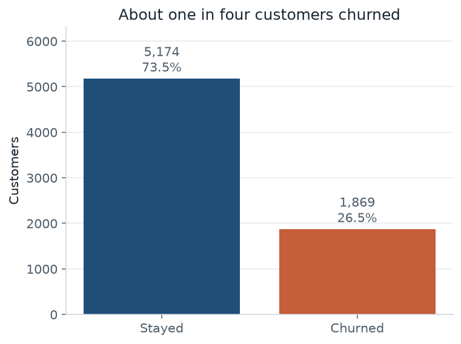
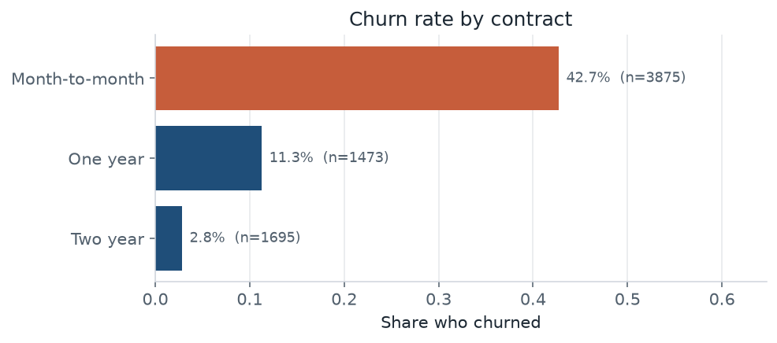
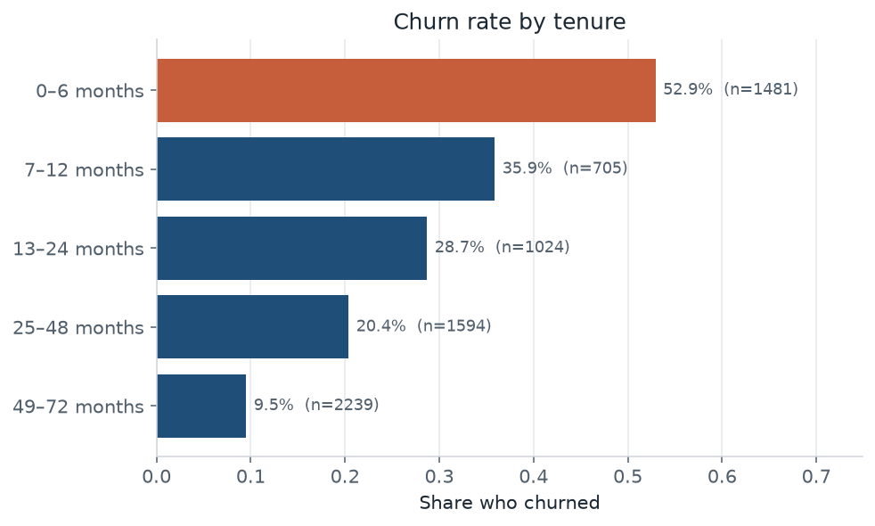
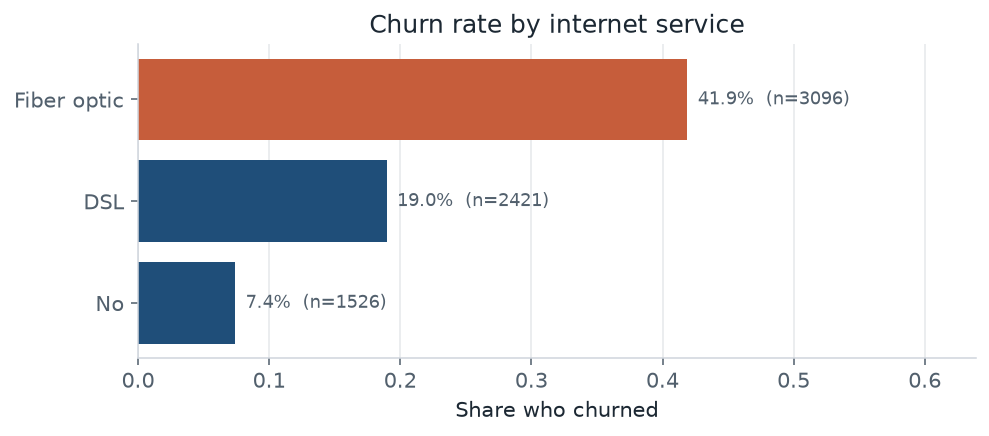
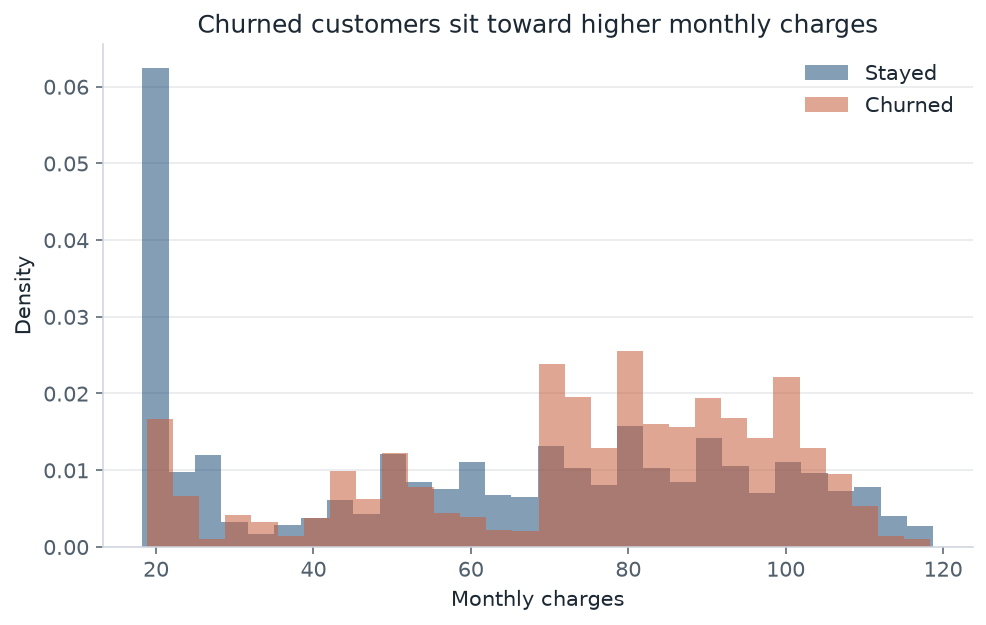
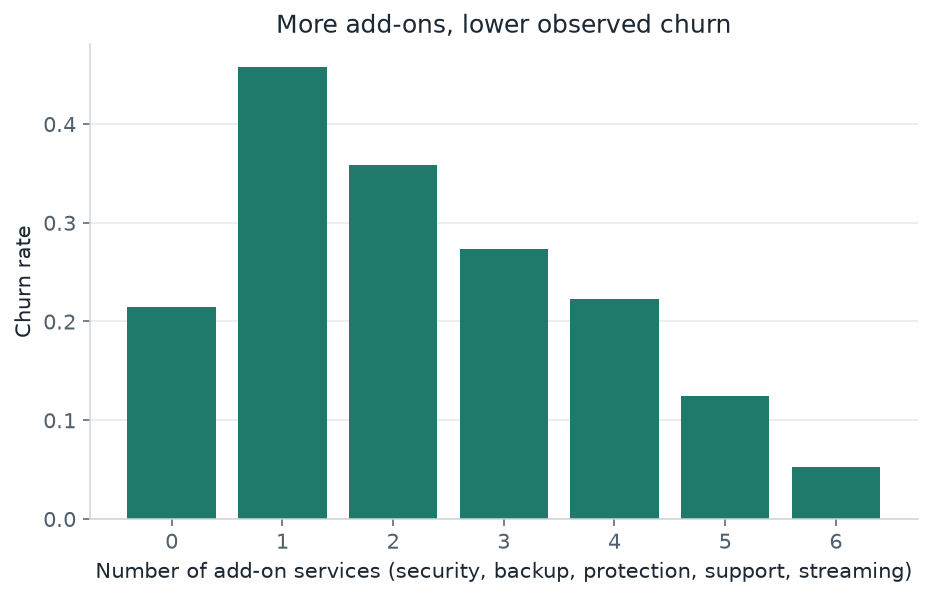
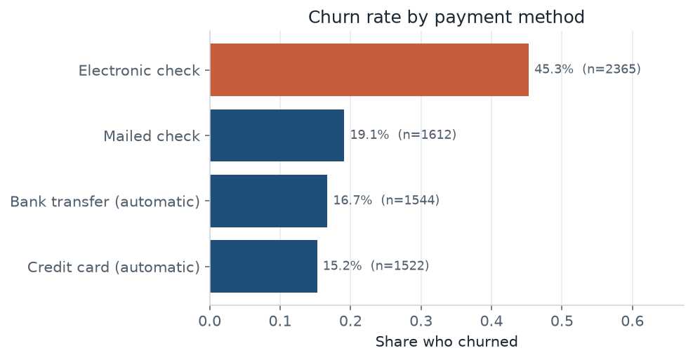

# Exploratory analysis: who leaves

Question for this pass: before fitting a model, which account patterns show up more often among customers who churn?

The plots below are computed from the IBM Telco Customer Churn sample (7,043 customers). Associations are descriptive. Contract, fiber, and payment method are chosen together, so a high churn rate on one slice is not by itself a reason to change that product.

## Data check

- 7,043 customers, 21 raw columns, one row per `customerID`.
- Target `Churn`: 1,869 left (26.5%) and 5,174 stayed (73.5%). A model that always predicts “stay” is already 73.5% accurate, so accuracy alone is a weak headline.
- `TotalCharges` is text. 11 values are blank, and all 11 of them are customers with `tenure` 0 who have not been billed. None of those new accounts are labeled as churned. The training pipeline sets those bills to 0 instead of filling them with the typical customer’s total.
- There are no other missing cells. `SeniorCitizen` is already 0/1. Service fields use “No internet service” or “No phone service” rather than nulls.

## Contract and tenure

Month-to-month customers churn at 42.7%. Two-year customers churn at 2.8%. The early-tenure bin (0–6 months) churns at 52.9%; customers who have already stayed 49–72 months churn at 9.5%.

Median tenure is 10 months among churners and 38 months among stayers. The people who leave are concentrated in short, flexible contracts. That can mean the contract causes them to leave, or that people who already expect to leave refuse a long contract. The model can use the pattern either way; a retention offer cannot treat it as a proven lever without an experiment.

| Contract | Customers | Churn rate |
| --- | ---: | ---: |
| Month-to-month | 3,875 | 42.7% |
| One year | 1,473 | 11.3% |
| Two year | 1,695 | 2.8% |

| Tenure | Customers | Churn rate |
| --- | ---: | ---: |
| 0–6 months | 1,481 | 52.9% |
| 7–12 months | 705 | 35.9% |
| 13–24 months | 1,024 | 28.7% |
| 25–48 months | 1,594 | 20.4% |
| 49–72 months | 2,239 | 9.5% |

## Service and bill

Fiber-optic customers churn at 41.9%, against 7.4% for customers with no internet service. Fiber also carries a higher monthly price, so this is tangled with the bill. Median monthly charges are $79.65 for churners and $64.43 for stayers.

| Internet service | Customers | Churn rate |
| --- | ---: | ---: |
| Fiber optic | 3,096 | 41.9% |
| DSL | 2,421 | 19.0% |
| No | 1,526 | 7.4% |

Among customers who have internet, missing protection lines up with leaving: OnlineSecurity = No churns at 41.8% versus 14.6% when the add-on is present. TechSupport = No churns at 41.6% versus 15.2% with support. Streaming shows a weaker gap. The engineered `addon_count` (how many of the six add-ons are “Yes”) falls as churn falls, which is the same pattern in one column. It is still confounded with tenure and contract: long-term customers collect more add-ons.

## Payment

Electronic check is the noisy payment method: churn 45.3%, compared with 15.2% for automatic credit card. Paperless billing is 33.6% versus 16.3% for paper bills. Both are markers worth handing to the model, not proof that the payment rail itself causes churn.

| Payment method | Customers | Churn rate |
| --- | ---: | ---: |
| Electronic check | 2,365 | 45.3% |
| Mailed check | 1,612 | 19.1% |
| Bank transfer (automatic) | 1,544 | 16.7% |
| Credit card (automatic) | 1,522 | 15.2% |

## What goes into the model

The classifier matrix keeps the raw service, contract, and demographic fields, plus two row-local features:

- `addon_count`: number of add-on columns equal to Yes.
- `avg_monthly_spend`: `TotalCharges / tenure` when tenure is positive, otherwise the listed `MonthlyCharges`.

`customerID` is dropped. Medians, scales, and one-hot levels are not computed here; the training script fits them inside a scikit-learn pipeline after the split.

